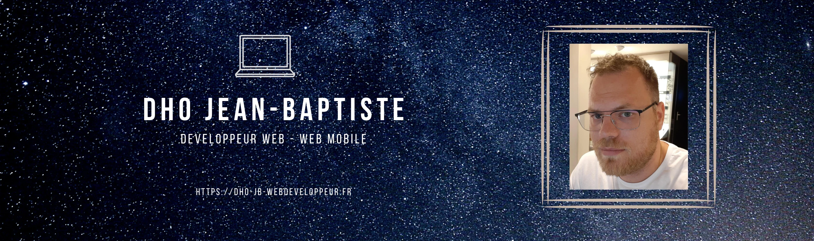

  

# Hi there 👋

Futur développeur web et web mobile.

RECHERCHE ACTIVEMENT UN STAGE DE DEUX MOIS ET DEMI DU 17 AVRIL AU 30 JUIN 2023.
***
## About me :

Nouveau développeur récemment arrivé sur Github ! 
Après une carrière de 15 dans l'optique, j'ai entrepris une reconversion dans un domaine qui me passionne depuis longtemps : le développement web. 
Avec ces nouvelles compétences, je compte devenir développeur full-stack. 
* 
A new developer just arrived on GitHub !
After a 15 years career as an optician, I decided to change paths towards a field that has long fascinated me : web development.
With this news skills, my goal is to become a full-stack developer.
***
Website : https://dho-jb-webdeveloppeur.fr 
Update : 10/02/2023
***
### Skills (dailies improvements :wink: ):

#### IDE : 

### GitHub Stats :

#### Languages (speaking & writing) :
English, French

